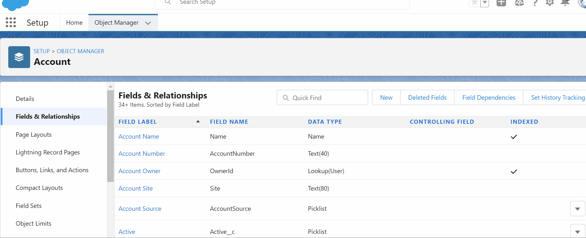

# Formula

Formula field automatically calculates a value based on other fields or a formula.

#### Task 1

- [ ] Done

In the account object make 2 fields num1 and num2. Then make a formula field sum to calculate the sum of num1 and num2.

# Validation Rules

- Use Cases: Verifies if the data that a user enters in a record meet certain data quality requirements.

- Whenever the record is saved the validation rule on that record is executed.

  

  #### Task 2

  - [ ] Done

Make a validation rule such that num1 and num2 from the earlier task should always be greater than 10 and display an error message if it's less than 10.

# Picklist

- Menus that expand to give users choices

#### Task 3

- [ ] Done

  Create a picklist on any object.

# Data Security Rules

- security model to secure data at different levels.
- Importance of giving the right people access to the right data.

### Profiles

- A Salesforce profile is a set of settings and permissions provided to specific Salesforce users.
- Used to define the extent of their actions on the platform. 
- There are two major types of user profiles in Salesforce.

1. Standard profiles
2. Custom profiles

| **Standard profiles**                         | **Custom profiles**                                          |
| --------------------------------------------- | ------------------------------------------------------------ |
| already provided by Salesforce                | profile can be created by the users  based on their specific requirements |
| System Administrator, Standard Platform  User |                                                              |
|                                               |                                                              |

### Permission Set

- Collection of settings and permissions that determine user's access to various tools and functions on the platform.
- Permission sets extend the functionality of users without changing their profiles
- Grants additional access to specific users on top of their existing profile permissions, without having to modify an existing profile, create new profiles, or grant an administrator profile where it’s not necessary.

### Roles

- Roles are designed to increase data visibility, to open up access to Salesforce records. 
- You will have a baseline visibility set for each object in your org, known as the ‘org wide default’ (organizational wide default, OWD).
-  Examples of this could be:

1. Opportunities are set to ‘Private’, which means that users can only see the opportunities they own.
2. Accounts are set to ‘Public Read/Write’, so that any user can help to update account information.

### Sharing Rules

- Sharing rules in Salesforce are used to create automatic exceptions to the Organization-Wide Default settings for the users who do not own the record.

- There are 2 types of Sharing Rules in Salesforce based on which records to be shared:

  

  **Owner Based**

  Owner based shares the records owned by certain users. Owners can be identified through public groups, roles and roles, and sub-ordinates

  

  **Criteria Based:**

  Criteria based shares the records that meet certain criteria.

### Public Group

- Assist when sharing access and synchronization of records

- Use case:

  when there are multiple offices for a company and you want to provide access to records or list views based on location. A public group for each office would allow each to view only records related to them. 

### Queue

- Salesforce Queues are a collection of records that doesn’t have any owner. 
- Users who have access to the queue can examine every record that is in it and claim ownership of the one’s they want.
- •Queues in Salesforce help to prioritize, distribute, and assign records to teams who share workloads.
